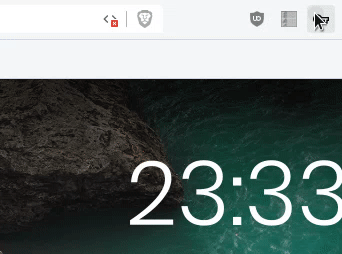

# Pass Companion
A lightweight browser companion for zx2c4's [Password Store](https://passwordstore.org).

<!-- Putting this here as an excuse to not have a Code of Conduct, if anyone complains about this needing one scream autisticly while pointing in this general direction -->
[GNU Coding Standards](https://www.gnu.org/prep/standards/standards.html)
[GNU Kind Communication Guidelines](https://www.gnu.org/philosophy/kind-communication.html)

## Features
- Clean and simple interface
- No dependency hell, Bootstrap 4 for css and Material Icons are the only external things used.
- Supports OTP, you can hide the button too!
- Source is somewhat readable

## Planned features/improvements
- Faster native script. Will mostly help slower hardware, faster hardware will not be effected most likely
- Gnome Extension. Having the native companion be easily installable as an extension would be quite nice. The UI would be the same, just in the desktop instead of in the browser.
- Blessing from Richard Stallman. This probably won't happen, I doubt he would touch a WebExtension, let alone bless one

## Known issues
* The native extension will not work in a Snapcraft package due to the aggressive sand-boxing preventing the gpg binary from getting required dependencies. This issue also effects the Browserpass binary
* On slower hardware (Intel celery, I'd suggest against using this on something slower) the native extension may take up to half a second to load. This is a problem I can't resolve without writing the native extension in another language, if you wish to make your own you can find the documentation on the protocol the extension uses [here](./native)

## Why did you make this?
The [browserpass-extension](https://github.com/browserpass/browserpass-extension) Team is deliberately omitting OTP support despite it already being in the previous version. Regardless of their reasoning you shouldn't be stripping features because of what you think about them. ~~I also have been wanting to replace browserpass because Go is Garbage so this gave me an excuse to get off my-~~

### But what if I ~~have Stockholm syndrome and live in California?~~ don't use otp in `pass`?
For special snowflakes like yourself, there's an option in settings to hide the otp button. It's the best of both worlds!

### I want to use more than one Password Store instance.
See below.

### My Password Store is stored somewhere other than `~/.password-store`!
Use a syslink. `ln -s "~/Documents/Git Projects/Password Store" "~/.password-store"`

### Where to complain <small>(If you are a browserpass user)</small>
- [browserpass/browserpass#322 Storing OTP together with password diminishes the purpose of 2FA, why not remove this functionality?](https://github.com/browserpass/browserpass/issues/322)
- [bbrowserpass/browserpass-extension#76 Support OTP in Browserpass v3](https://github.com/browserpass/browserpass-extension/issues/76)

### Will you support <small>~~Firefox~~, <small>~~Blue Moon~~, <small>~~Opera~~, <small>~~Internet Explorer 5~~, <small>~~Maxthon~~, <small>~~Lynx~~, <small>~~`$WHATEVER_BROWSER_IS_BEING_SHILLED_ON_IMAGEBOARDS_THIS_WEEK`~~, <small>curl?</small></small></small></small></small></small></small></small>
I don't use `$TRENDYBROWSER` nor do I have any experience developing `$TRENDYBROWSER` extensions. If you want to make a PR adding support, feel free. If adding support, I'd recommend against using preprocessors as they add an extra step to the development process.

### What do you support?
Browser|Issues
----|----
Brave|None
Chrom*|None

## Icon
Favicon used is `vpn_key` from [Material Icons](https://material.io/tools/icons/?search=key&icon=vpn_key&style=outline). If anyone want's to make their own because `>a fucking key` sucks, feel free, I'm no designer.
